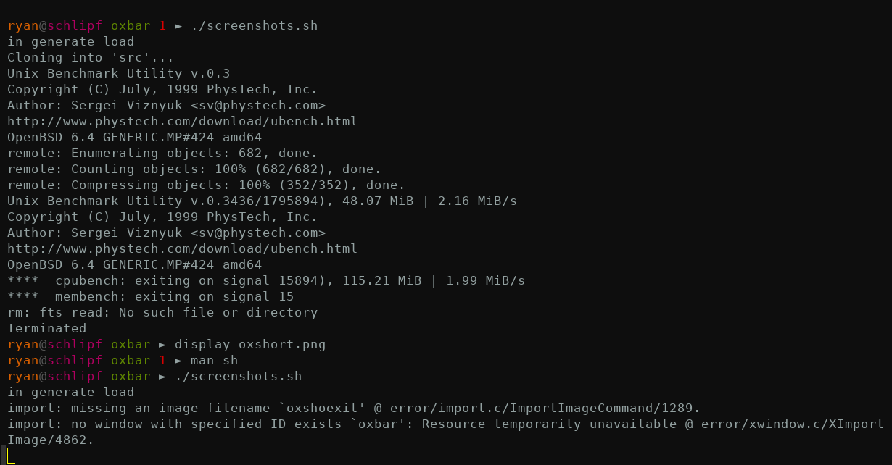

# oxbar

oxbar is a X11 status bar for OpenBSD showing various system stats.
It has a configurable display and works out-of-the-box on most modern window
managers in an intuitive fashion.
oxbar supports FreeType font rendering and styling, true transparency & alpha
blending on all UI components (including the root window), and a simple
configuration format that can concisely support multiple themes.

It's motivated mostly by the frequent derisions/complaints/threats I get about
my old xstatbar and its many shortcomings/hacks. Shaming works 'yo.

oxbar is released under an
[ISC license](https://github.com/ryanflannery/oxbar/blob/master/LICENSE)

# status

oxbar is still under active development, but is now stable and usable. There's
little documentation still (a minimal `man` page but a usable `-h` to get
started, and a sample configuration that explains some options).
Better documentation is forthcoming, once development settles. Likely soon.

It supports all the command line flags `xstatbar` did and much more... most
aspects of the widgets can be configured through `-S widget.name=value` flags.
If you take a look at
[settings.c](https://github.com/ryanflannery/oxbar/blob/master/settings.c)
you'll see what they all are.

# current features

   * True transparency support with a compositing window manager
     (I recommend compton in ports over xcompmgr in base)
   * FreeType fonts rendered beautifully & easily w/ pango
   * Configurable display (all colors, text, spacing, etc)
   * Left/Right/Center aligned widgets (and any combination of those)
   * Widgets can be configured on the command line
   * Configuration file is concise & can support multiple different displays/themes
   * Types of stats supported:
      * Battery/AC status, simple progress bar, time remaining
      * Volume level w/ progress bar (mute status forthcoming )
      * Number of processes (current total # processes only as of now)
      * Memory usage & breakdown (current only as of now)
      * CPUs usage & breakdown w/ charts
      * Current date/time (is that a status?)

# screenshots


[View (raw) Image](images/default.png?raw=true)

Other themes:



# usage

See `oxbar -h` for the basics and the sample configuration file included for
more examples. Otherwise wait until I can complete the man page.

## i liked xstatbar's look

You can achieve that using the included sample configuration file, saved as
`~/.oxbar.conf`, and run oxbar via:
```bash
oxbar xstatbar
```

The only thing lacking is each individual cpu's states being shown. That is
forthcoming.

# outstanding stuff, prioritized

Roughly in order or my priority...

   * document! man page and -h flags
   * gui: icons in the display could help condense it further
   * stats: add tracker for hw.sensors
   * stats: add a weather component...i like weather
   * gui: support vertical rendering (a sidebar!)
   * when using compton, need '--shadow-exclude 'name = "oxbar"' to disable
     shadow - how can i automate that?
