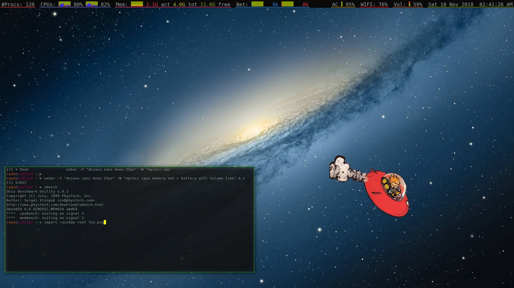

# oxbar

oxbar is a X11 status bar for OpenBSD showing various system stats.
It has a configurable display and works out-of-the-box on most modern window
managers in an intuitive fashion.
oxbar supports FreeType font rendering and styling, true transparency & alpha
blending on all UI components (including the root window), and a simple
configuration format that can concisely support multiple themes.

It's motivated mostly by the frequent derisions/complaints/threats I get about
my old xstatbar and its many shortcomings/hacks. Shaming works 'yo.

oxbar is released under an
[ISC license](https://github.com/ryanflannery/oxbar/blob/master/LICENSE)



# features

   * True transparency support with a compositing window manager
     (I recommend compton in ports over xcompmgr in base)
   * FreeType fonts styled & rendered easily
   * Fully configurable display via the command line or config file
   * Left/Right/Center aligned widgets (and any combination of those)
   * Configuration file support multiple themes that can be chosen at runtime
   * Types of stats supported:
      * Battery/AC status, simple progress bar, time remaining
      * Volume level w/ progress bar (mute status forthcoming )
      * Number of processes (current total # processes only as of now)
      * Memory usage & breakdown (current only as of now)
      * CPUs usage & breakdown w/ charts
      * WiFi signal strength
      * Current date/time (is that a status?)
      * Others forthcoming

# screenshots

oxbar's default look:


Other themes, all included in the file
[sample.oxbar.conf](sample.oxbar.conf):

**islands**: each widget is an island, with true transparency between


**islands-colorful**: like islands, but each widget is a different color


**minimal**: a dark, text only display


**pastel-dense**: a pastel based theme with widgets tightly packed


**ryan**: what my setup looks like


**xstatbar**: looks just like it's predecessor


# usage

Full man page available here:
[oxbar(1)](http://htmlpreview.github.io/?https://raw.githubusercontent.com/ryanflannery/oxbar/master/man/oxbar.html).

`oxbar -H` also has a brief description of each command line flag.
See the sample configuration [sample.oxbar.conf](sample.oxbar.conf) for
examples, like the themes above.

# i liked xstatbar's look

You can achieve that using the included sample configuration file, saved as
`~/.oxbar.conf`, and run oxbar via:
```bash
oxbar xstatbar
```
# outstanding stuff, prioritized

Roughly in order or my priority...

   * gui: icons in the display could help condense it further
   * stats: add tracker for hw.sensors
   * stats: add a weather component...i like weather
   * gui: support vertical rendering (a sidebar!)
   * when using compton, need '--shadow-exclude 'name = "oxbar"' to disable
     shadow - how can i automate that?
